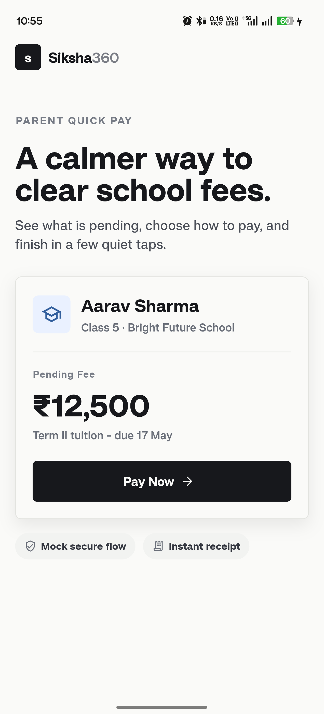
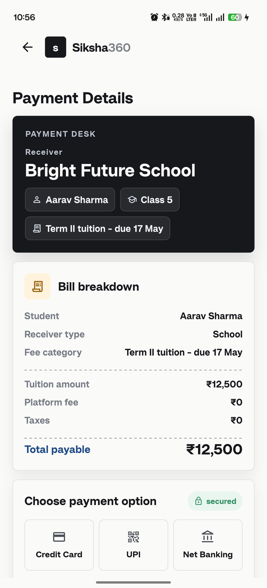
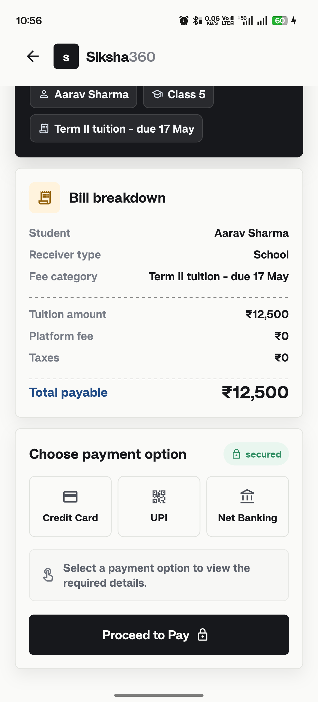
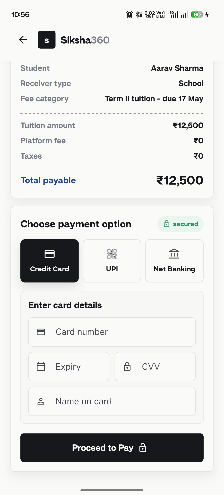
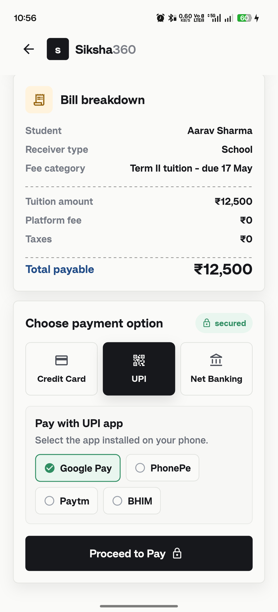
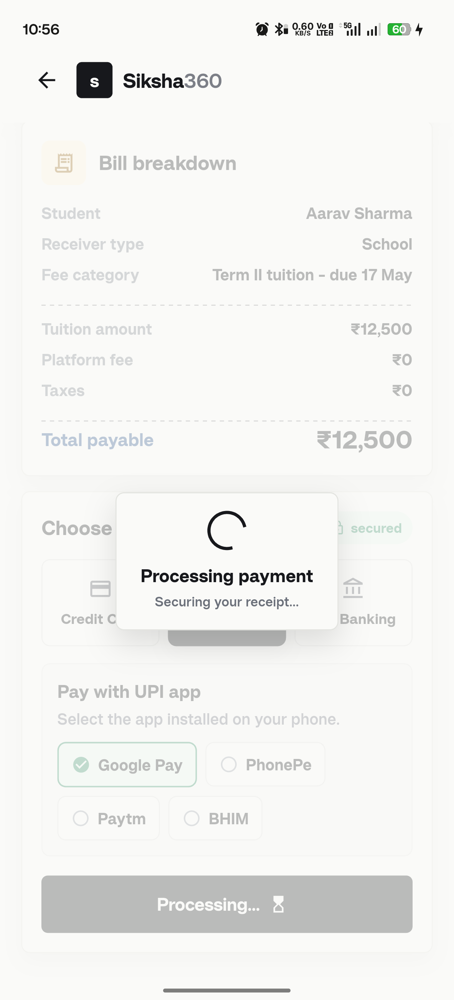
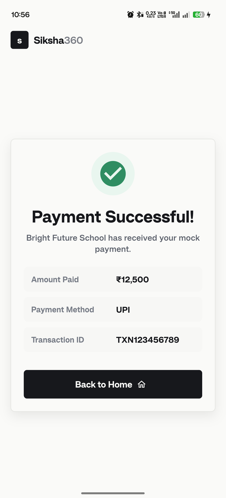

# Siksha360

Siksha360 is a Flutter-based fee payment assistant designed for parents and guardians to pay school fees quickly through UPI, net banking, and card payments.

## 📌 Project Overview

This app includes:
- Home screen with fee summary and payment flow entry
- Detailed bill breakdown with total payable amount
- Selectable payment methods: Credit Card, UPI, Net Banking
- UPI and bank selection panels with action buttons
- Success confirmation screen after payment submission
- Router-based navigation and Bloc state management

## 📱 Screenshots

Below are sample screens from the app:















## 🚀 APK Download

Use the APK link to install the app directly on Android devices:

[Download Siksha360 APK](https://drive.google.com/file/d/1P97x35OhR6hcZHj-p5MD8jQVnMuQoInP/view?usp=sharing)

## 🛠️ Prerequisites

Before building or running the app locally, make sure you have:

- Flutter SDK installed (latest stable channel)
- Android Studio or VS Code with Flutter plugins
- Xcode installed for iOS builds (macOS only)
- An Android device/emulator or iOS simulator connected

## 💻 Setup Instructions

1. Clone the repository:

```bash
git clone <repository-url>
cd siksha360
```

2. Fetch dependencies:

```bash
flutter pub get
```

3. Check Flutter environment and connected devices:

```bash
flutter doctor
flutter devices
```

## ▶️ Run the App

### Android

```bash
flutter run
```

### iOS

```bash
flutter run
```

> For iOS, run from macOS and ensure the simulator or device is configured.

## 📦 Build Instructions

### Build Android APK

```bash
flutter build apk --release
```

The release APK will be available in:

```bash
build/app/outputs/flutter-apk/app-release.apk
```

### Build App Bundle

```bash
flutter build appbundle --release
```

### Build iOS

```bash
flutter build ios --release
```

> iOS builds require Xcode and a valid Apple developer profile.

## 🧩 Project Structure

- `lib/` — main application source files
- `lib/blocs/` — Bloc state management code
- `lib/screens/` — screen and UI pages
- `lib/widgets/` — reusable widgets
- `lib/utils/` — shared styles, colors, and helper utilities
- `android/`, `ios/` — native platform configuration

## 🎯 Notes

- The payment flow is managed via `go_router` and `flutter_bloc`.
- Shared theme values are defined in `lib/utils/colors.dart`.
- The app uses a custom 3D-style action button and modern UI panels.

## 📬 Contact

If you need help building or extending this project, feel free to open an issue or reach out to the maintainer.
